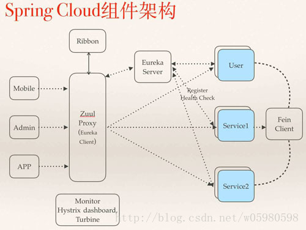
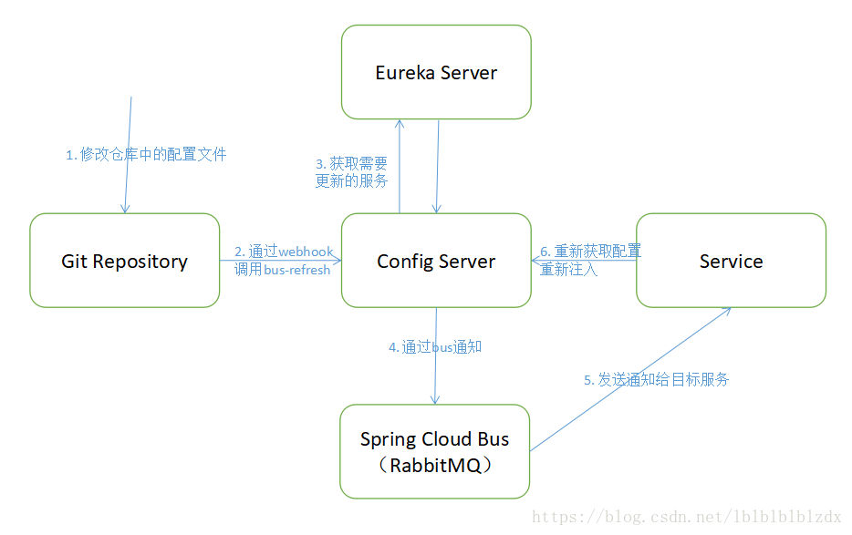
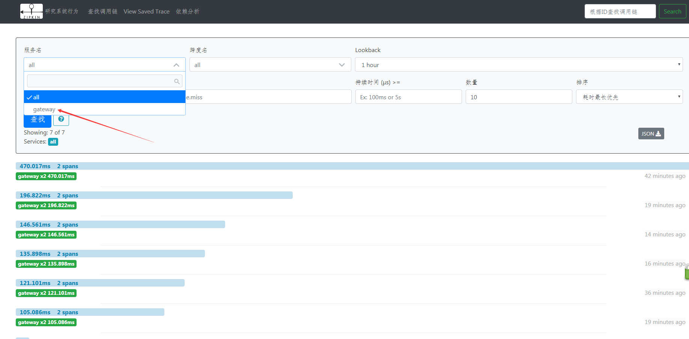

# SprinCloud

### [相关优质项目](https://springcloud.cc/)
### [参考](https://github.com/forezp/SpringCloudLearning)
#### 基础概念: [核心组件](https://blog.csdn.net/forezp/article/details/83999882)
>* Eureka：各个服务启动时，Eureka Client都会将服务注册到Eureka Server，并且Eureka Client还可以反过来从Eureka Server拉取注册表，从而知道其他服务在哪里
>* Ribbon：服务间发起请求的时候，基于Ribbon做负载均衡，从一个服务的多台机器中选择一台
>* Feign：基于Feign的动态代理机制，根据注解和选择的机器，拼接请求URL地址，发起请求  
>* Hystrix：发起请求是通过Hystrix的线程池来走的，不同的服务走不同的线程池，实现了不同服务调用的隔离，避免了服务雪崩的问题
>* Zuul：如果前端、移动端要调用后端系统，统一从Zuul网关进入，由Zuul网关转发请求给对应的服务
#### 1.Spring Cloud Netflix
>>此包下有Netflix Eureka（服务注册，服务发现）、Netflix Hystrix（仪表盘，熔断器）、Netflix Zuul（动态路由，拦截器）、Netflix Archaius（配置管理API）
四个主要模块。目前项目实现了前三个实例。
>* eureka-server：此服务是EurekaServer，即服务注册中心
>* eureka-client：此服务是EurekaClient，即普通服务发现。服务发现可以使用EurekaClient,也可以使用DiscoveryClient。一般如果我们使用restTemplate + Ribbon服务调用则使用前者，而使用其他，例如Feign服务调用则使用后者
>* eureka-consumer：此服务是实现了断路器基于restTemplate + Ribbon服务调用的实例，此服务连接了配置中心configserver
>* eureka-consumer2：此服务是实现了断路器基于restTemplate + Ribbon服务调用的实例,此服务连接了配置中心configserver,此两个示例是验证配置中心利用消息总线实现所有服务的配置实时刷新，只需调用 [POST]:localhost:xxxx/actuator/bus-refresh 接口即可实现所有连接配置中心的服务配置刷新功能
>* discovery-consumer：此服务是基于DiscoveryClient服务调用的实例
>* zuul：此服务是实现了Zuul（网关）,动态路由到eurekaconsumer、eurekaconsumer2以及discoveryConsumer三个服务
>* hystrix-dashboard：此服务是实现了HystrixDashboard，即仪表盘服务
>>调用模型
>* 所有服务注册于服务中心
>* hystrix-dashboard监控
>* 各个服务之间可以互相调用
#### 2.Spring Cloud Config
>>将配置文件放到Git仓库中统一管理。配置信息的传输可以进行加密，但此实例没有加密处理
>* configserver：此服务充当配置中心服务器
>* eurekaconsumer & eurekaconsumer2：此服务的配置放到Git仓库中，配置命名为：application name + profile 例如：eurekaconsumer-dev.properties ;通过连接配置服务器configserver（连接的信息一定要写在bootstrap.properties文件中）获取对应的配置
#### 3.Spring Cloud Bus
>>消息总线：通知服务器某个事件发生，然后由服务器通知客户端。此处结合RabbitMQ使用，也可以结合Kafka（集成起来比RabbitMQ简单）。有一个坑就是2.0版本和之前版本有[改动的地方](https://www.cnblogs.com/lzj123/p/9724499.html),此实例支持手动通知，即敲连接：localhost:8767/actuator/bus-refresh。自动通知有待研究
>* discoveryConsumer: RabbitMQ简单使用
>* eurekaconsumer & eurekaconsumer2: 配置客户端
>* configserver: 配置服务端
>* 
#### 4.Spring Cloud Sleuth
>* zipkin-server：链路追踪服务
>* discoveryConsumer & eurekaconsumer & eurekaconsumer2 & eureka-client以及gateway都配置了链路追踪
>* 目前只有gateway服务能被链路检测到，其他的无法被检测到，问题原因还未找到
>* 
#### 5.Spring Cloud for Cloud Foundry
#### 6.Spring Cloud Cluster
#### 7.Spring Cloud Consul
